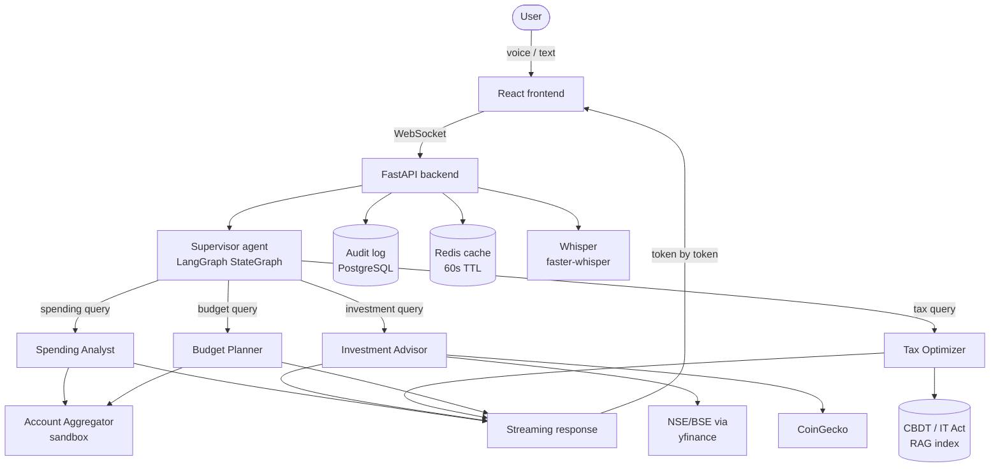

# FinVoice

**Voice-first multi-agent personal finance assistant**


---

## What it does

- Users speak or type a financial question. A supervisor agent routes it to the right specialist: Spending Analyst, Investment Advisor, Tax Optimizer, or Budget Planner.
- Answers stream back in real time with the responding agent named in the UI.
- Proactive weekly briefings are delivered without the user asking.

---

## Architecture



---

## Agent breakdown

| Agent | Tools | Example queries |
|---|---|---|
| Spending Analyst | Account Aggregator sandbox, pgvector transaction search | "Where did I spend the most last month?" "Flag any transactions over ₹2,000." |
| Investment Advisor | NSE/BSE via yfinance, CoinGecko | "How is my mutual fund portfolio performing this quarter?" "What is the P/E on Infosys?" |
| Tax Optimizer | CBDT / Income Tax Act RAG index | "What expenses can I claim as a freelance consultant?" "How does LTCG tax work on my equity funds?" |
| Budget Planner | Account Aggregator sandbox, cash flow model | "Am I on track this month?" "How much can I save if I cut dining out by half?" |

All Tax Optimizer and Investment Advisor responses include the disclaimer: "This is informational only and does not constitute regulated financial advice. Consult a SEBI-registered advisor."

---

## Tech stack

| Layer | Technology |
|---|---|
| Backend | Python 3.11, FastAPI, LangGraph |
| Frontend | React 18, TypeScript, WebSocket |
| LLM | Claude claude-sonnet-4-6 (primary), Groq Llama 3 (fallback) |
| Voice | faster-whisper (self-hosted) |
| Database | PostgreSQL 15 + pgvector extension |
| Cache | Redis (60s TTL on all market data) |
| Banking data | Account Aggregator framework via Finvu sandbox |
| Market data | NSE/BSE via yfinance (.NS suffix), CoinGecko |
| Deployment | Docker Compose (local), Railway or Render (demo) |

---

## Quick start

Prerequisites: Docker and Docker Compose installed.

```bash
git clone https://github.com/bukkasreenivas/finvoice.git
cd finvoice
cp .env.example .env
# Add your API keys to .env
docker-compose up
```

The app is available at `http://localhost:3000`.

The backend API is at `http://localhost:8000`.

API documentation is at `http://localhost:8000/docs`.

---

## Environment variables

Copy `.env.example` to `.env` and fill in the values. Required keys:

- `ANTHROPIC_API_KEY` — Claude API access
- `FINVU_CLIENT_ID` and `FINVU_CLIENT_SECRET` — Finvu Account Aggregator sandbox credentials
- `DATABASE_URL` — PostgreSQL connection string (pre-configured in Docker Compose)

All other variables are optional or have defaults. See `.env.example` for the full list.

---

## PM artefacts

These documents are in the `docs/` folder. They demonstrate AI-native product thinking alongside the code.

| Document | Description |
|---|---|
| [PRD.md](docs/PRD.md) | Full product requirements document covering problem statement, personas, functional requirements per agent, and non-functional requirements |
| [user-research.md](docs/user-research.md) | Synthesis of seven qualitative interviews with JTBD statements and product implications |
| [competitive-analysis.md](docs/competitive-analysis.md) | Comparison of FinVoice against CRED, Fi Money, Jupiter, Groww, and Money View |
| [roadmap.md](docs/roadmap.md) | Three milestone phases with MoSCoW priorities, dependency graphs, and success criteria |
| [metrics.md](docs/metrics.md) | North star metric, guardrail metrics, leading indicators, and PostgreSQL instrumentation schema |
| [experiment-design.md](docs/experiment-design.md) | A/B experiment design: voice input vs text input, including hypothesis, sample size calculation, and failure criteria |
| [ai-prompt-journal.md](docs/ai-prompt-journal.md) | Log of prompts used to build this project with PM decisions at each step |

For a narrative account of the AI-native development methodology, see [BUILDING_WITH_AI.md](BUILDING_WITH_AI.md).

---

## Skills demonstrated

This project demonstrates the following enterprise AI capabilities:

- **Multi-agent orchestration** — LangGraph StateGraph with deterministic routing, checkpointing, and audit logging. Four specialist agents with a supervisor that routes by query intent.

- **RAG on structured data** — pgvector extension on PostgreSQL for semantic search over transaction history. Enables contextual follow-up queries ("what did I spend on groceries last month?").

- **Voice and multimodal input** — Self-hosted Whisper via faster-whisper for speech-to-text. Push-to-talk UI with transcript confirmation before submission.

- **Real-time streaming** — FastAPI WebSocket endpoint streams agent responses token by token. React hooks manage the connection and render incrementally.

- **Regulatory awareness** — Audit log on every query. SEBI disclaimer coverage tracked as a guardrail metric. Account Aggregator sandbox only (no real banking data). ADRs document compliance scope decisions.

- **AI-native PM methodology** — PRD, user research, competitive analysis, metrics framework, and experiment design all produced with Claude. The ai-prompt-journal.md documents every significant prompt with the human decision that followed.

- **MCP server design** — See Project 3 in this portfolio for a full Model Context Protocol server implementation.

---

## Author

Sreenivas Bukka, Product Manager

This project is part of a four-project AI portfolio built to demonstrate enterprise AI skills. The other three projects are in the same GitHub profile.
